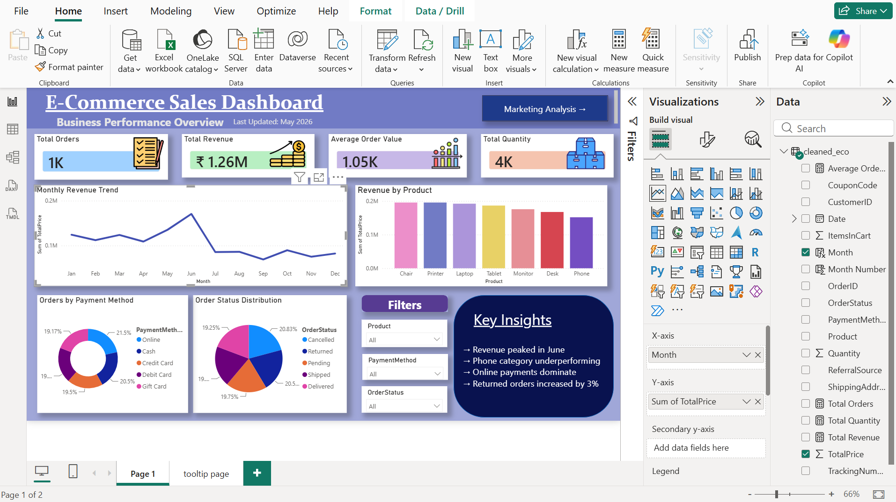

# 📊 E-Commerce Data Analysis

*Analyzing e-commerce transaction data to uncover sales, customer, and product trends — and turning them into business recommendations.*


<!-- Replace with an actual screenshot: project/assets/dashboard-preview.png -->

---

## 📌 Overview

This project analyzes an e-commerce dataset to answer real business questions — which categories drive revenue, who the highest-value customers are, and where the business is losing money — using a full workflow: **data cleaning → exploratory analysis → SQL querying → Power BI dashboard → business recommendations.**

**Dataset:** [Dataset name + source link] — e.g. Kaggle "Online Retail" dataset, X rows, Y columns, covering [date range].

---

## 🎯 Business Questions

- Which product categories and regions generate the most revenue and profit?
- Who are the highest-value customers, and what do they have in common?
- Are discounts/promotions actually improving margins, or hurting them?
- What seasonal or monthly trends affect sales?
- Where are the biggest drop-offs or inefficiencies (returns, cancellations, delays)?

---

## 💡 Key Insights

*(Replace with your real findings — use actual numbers wherever possible.)*

- Category **[X]** contributed **[~40%]** of total revenue but had a **[15%]** return rate — the highest of any category.
- The top **[10%]** of customers by spend accounted for **[~35%]** of total revenue (classic 80/20 pattern).
- Sales peaked in **[month/quarter]**, driven mainly by **[category/event]**.
- Orders with heavy discounting (**[>X%]** off) had **[lower/similar]** net margin compared to full-price orders.
- **[Region/segment]** had the slowest fulfillment times, correlating with more cancellations.

---

## ✅ Business Recommendations

*(This section is what turns "data analysis" into "business analytics" — translate findings into decisions.)*

1. Reduce blanket discounting on **[category]** — margin data suggests it isn't converting to incremental revenue.
2. Prioritize retention campaigns for the top **[10%]** customer segment identified via RFM analysis.
3. Investigate fulfillment delays in **[region]** — likely driver of higher cancellation rate.
4. Double down on **[category/season]**, which shows consistent YoY growth.

---

## 🛠️ Tech Stack

| Layer | Tools |
|---|---|
| Data Cleaning & EDA | Python, Pandas, NumPy, Matplotlib, Seaborn |
| Querying & Analysis | SQL |
| Dashboard | Power BI (DAX, Power Query) |
| Environment | Jupyter Notebook |

---

## 📂 Project Structure

```
E-Commerce-Data-Analysis/
│
├── data/
│   └── raw_ecommerce.csv          # original dataset (or link if too large for repo)
│
├── notebooks/
│   ├── 01_data_cleaning.ipynb
│   └── 02_eda.ipynb
│
├── sql/
│   └── business_queries.sql
│
├── dashboard/
│   ├── Dashboard.pbix
│   └── dashboard-preview.png
│
├── requirements.txt
└── README.md
```

---

## 🗄️ SQL Analysis

Business questions answered directly in SQL (`sql/business_queries.sql`):

- Total revenue and order volume by category and month
- Top 10 customers by lifetime value
- Category-wise average order value and return rate
- Month-over-month revenue growth
- Customer segmentation by order frequency (RFM-style)

---

## 📊 Power BI Dashboard

Interactive dashboard (`dashboard/Dashboard.pbix`) with:

- KPI cards: total revenue, orders, AOV, return rate
- Revenue trend over time (with MoM/YoY DAX measures)
- Category and regional breakdown with drill-through
- Customer segment view

**Screenshot:**


---

## 🚀 How to Run

```bash
# 1. Clone the repository
git clone https://github.com/yashagrawalarts098765-oss/E-Commerce-Data-Analysis.git
cd E-Commerce-Data-Analysis

# 2. Install dependencies
pip install -r requirements.txt

# 3. Run the notebooks in order
jupyter notebook notebooks/01_data_cleaning.ipynb
jupyter notebook notebooks/02_eda.ipynb

# 4. Open the dashboard
# Open dashboard/Dashboard.pbix in Power BI Desktop
```

---

## 📈 Key Learnings

- End-to-end analytics workflow: raw data → cleaned dataset → SQL insights → BI dashboard
- Writing SQL to answer specific business questions, not just exploratory queries
- Building DAX measures for time-intelligence (MoM, YTD growth)
- Translating data findings into actionable business recommendations

---

## 👨‍💻 Author

**Yash Agrawal**
Aspiring Data Analyst | Python · SQL · Power BI · Excel

[LinkedIn](https://www.linkedin.com/in/yash-agrawal-71b6a8302/) · [Portfolio](https://github.com/yashagrawalarts098765-oss/E-Commerce-Data-Analysis) · [Email](yashagrawalarts098765@gmail)

---

⭐ If you found this useful, consider starring the repo!
